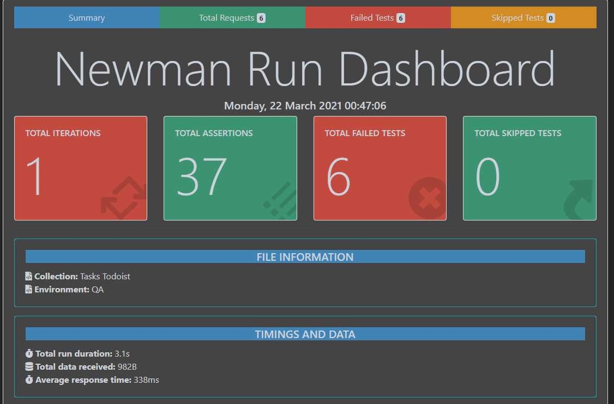
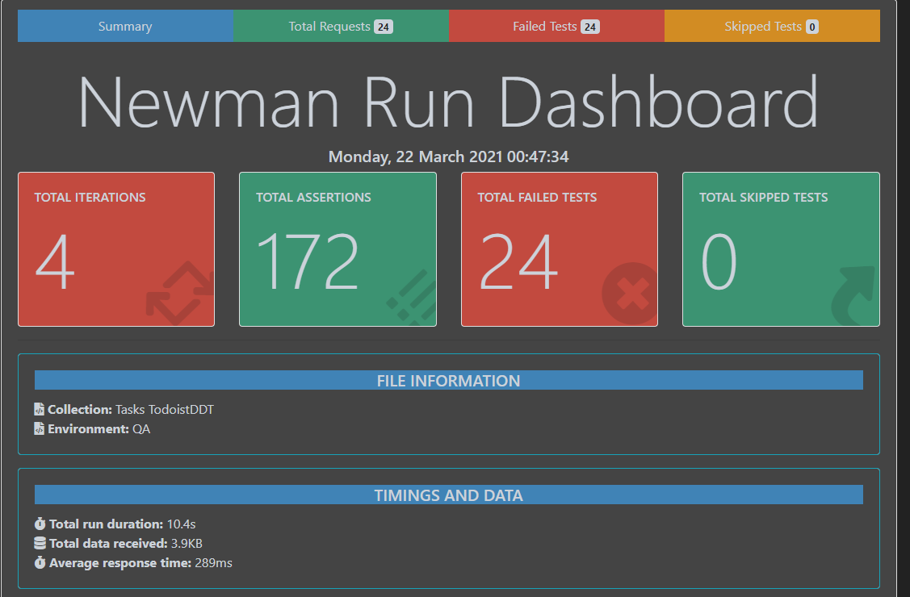

# Assesment 2 - Postman & Newman 
###QA Automation Certification 

This repository contains my challenge exercises to get the QA Certification from Wizeline

## Installation

1. Clone this repository:

    ```sh
    git clone https://github.com/ruvaz/newman-test.git
    ```

2. Go to the project's root directory:

    ```sh
    cd newman-test
    ```

3. Install the dependencies:

    ```sh
    npm install -g newman
	npm install -g newman-reporter-htmlextra
    ```

## Usage

Use the `testQA` script to run all task tests.

> You will find the file in the path: ./reports/report.html

```sh
npm run testQA
```




Use the `testQADDT` script to run  several task from a csv file.

> You will find the file in the path: ./reports/report.html

```sh
npm run testQADDT
```




Use the `testPRD` script to run all tests in CI/CD,   geting the token by CLI.

> precondition: You have to set the system environment var: TOKEN_TODOIST = token from todoist.com

```sh
export TOKEN_TODOIST='token_from_todoist.com'
npm run testPRD
```


## Test in this Repository

Assessment session 2

The repository includes the following examples:

- Create a new task
- Get active tasks
- Get and active task
- Update a task status to 'complete'
- Reopen a task
- Delete a task

Negative scenario for each one.

## Bonus
**CI / CD API KEY**
My proposed way to not save the TOKEN API KEY in the repository, create the script `testPRD` where I implement a --env-var to receive the TOKEN as a parameter, to facilitate its execution from a CI / CD system with a simple 

```sh
export TOKEN_TODOIST = 'token from todoist.com'
```

**Reports**
Each script configured in package.json creates a report in html using the newman-reporter-htmlextra plugin. the location of the reports is: 

```
test/backend/reports/
```

**Various job tests using DDT**
Create the `testQADDT` script to record 4 tasks with different date to be able to test all cases.